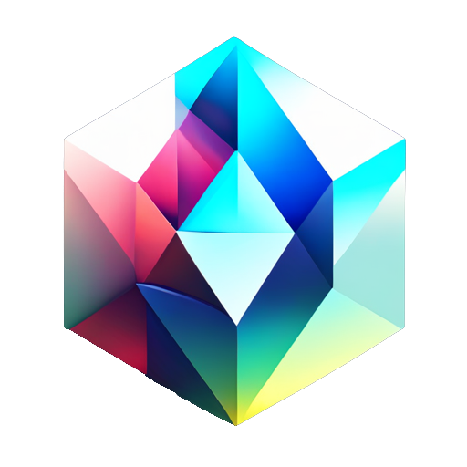

<h1 align="center">Novexity</h1>
<div align="center">
    
</div>

<h4 align="center">Open Source SerpAPI Google Search Alternative 🌐</h4>
<h5 align="center">Freely Scrape Google Search Results Fast and Easy ✨</h5>

<div align="center">

<a href="https://github.com/NorkzYT/Novexity/graphs/contributors"></a>
<a href="https://github.com/NorkzYT/Novexity/network/members"></a>
<a href="https://github.com/NorkzYT/Novexity/stargazers"></a>
<a href="https://github.com/NorkzYT/Novexity/issues"></a>
<a href="https://github.com/NorkzYT/Novexity/issues?q=is%3Aissue+is%3Aclosed"></a>
<a href="https://github.com/NorkzYT/Novexity/blob/master/LICENSE"></a>

</div>

<h2 align="left">🔧 Installation</h2>

```bash
pip install Novexity
```

<h2 align="left">🛠 Setup</h2>

Make an AWS account and create a new IAM user with the permission of `AmazonAPIGatewayAdministrator`. Then, to find your access key ID and secret access key, follow the [official AWS tutorial](https://docs.aws.amazon.com/powershell/latest/userguide/pstools-appendix-sign-up.html).

Set up your AWS credentials in your `.env` file or with [awscli](https://docs.aws.amazon.com/cli/latest/userguide/getting-started-install.html) by running `aws configure`.

```env
GOOGLE_SEARCH_AWS_ACCESS_KEY_ID=your_access_key_id
GOOGLE_SEARCH_AWS_SECRET_ACCESS_KEY=your_secret_access_key
```

<h2 align="left">📖 Usage</h2>

Example usage:

```python
import os
from dotenv import load_dotenv
from novexity import NovexitySearch, configure
load_dotenv()

AWS_ACCESS_KEY_ID = os.getenv('GOOGLE_SEARCH_AWS_ACCESS_KEY_ID')
AWS_SECRET_ACCESS_KEY = os.getenv('GOOGLE_SEARCH_AWS_SECRET_ACCESS_KEY')
configure(aws_access_key_id=AWS_ACCESS_KEY_ID,
          aws_secret_access_key=AWS_SECRET_ACCESS_KEY)

params = {
    "q": "Minecraft",
    "country": "fr",
    "lang": "fr"
}

# Initialize NovexitySearch with the parameters
novexity_search = NovexitySearch(params)

# Get the search results
novexity, returned_gateway = novexity_search.get_dict()

# Save the results to search.json
with open("google-search.json", "w", encoding="utf-8") as file:
    file.write(novexity)

# Shut down the gateways
returned_gateway.shutdown()
```

⚠️ Remember: If gateways are not shut down via the `shutdown()` method, you may incur charges.

<details>
  <summary>📌 Output: </summary>
  
```json
{
  "organic_results": [
    {
      "position": 1,
      "title": "Site officiel | Minecraft",
      "link": "https://www.minecraft.net/fr-fr",
      "displayed_link": "Minecraft https://www.minecraft.net › fr-fr",
      "favicon": "data:image/png;base64,iVBORw0KGgoAAAANSUhEUgAAACAAAAAgCAMAAABEpIrGAAAAYFBMVEVSpTVTpzZOnzNDjCxGkC1AgioNHwkNGggMGAcWMA9LlzA+fCgECAMAAABFiC0gNBceMBYlQBperEBSlzgQJgtFiywGDQQZNxATKgxAgCkNFAlSkDlanz8TIw1ToTdVlTxP7l7cAAAAsUlEQVR4Ad2RBQ7CMBRA6ba6zV3uf0sqWBPc4cW+6+qvAI5ADohiS+KVxClRkA8RxphQBozMKDEKguAwgAtpID6AWFnwIwHYB+C7AuSmhcG3kGGA0qkhi5khzqysVbhobiloaaCFU44dq6qloa7A6ihRBH0AjKKj6Q1thTSIljZHioBOyB2i+1xA7zgdQIbRMJCTAdj/Ah8PgL2Y/Dcn0cMjx5yXZfGSEeZjpzSE0tewBofsD3nOEHV9AAAAAElFTkSuQmCC",
      "snippet": "Minecraft est un jeu qui consiste à placer des blocs et à partir dans des aventures. Achète-le ici ou explore le site à la recherche des dernières nouvelles ...",
      "source": "https://www.minecraft.net › fr-fr"
    },
    {
      "position": 2,
      "title": "Minecraft",
      "link": "https://fr.wikipedia.org/wiki/Minecraft",
      "displayed_link": "Wikipédia https://fr.wikipedia.org › wiki › Minecraft",
      "favicon": "data:image/png;base64,iVBORw0KGgoAAAANSUhEUgAAACAAAAAgCAMAAABEpIrGAAAAM1BMVEUAAAD+/v41NTUBAQEAAABZWVknJycWFhaZmZmIiIjp6ellZWXMzMzX19eurq54eHhHR0dExXFyAAAAAXRSTlMAQObYZgAAAPtJREFUeAG8kAWOBDAMA9d1Sin+/7XXbpZZdBaURlMrhx28ycGCD/n0bvkBwJf8C+AoIvRAWGtMyHGtCWkfxW+DRopuuIjUtTQJDStevNoXWaRjRSllLd1O8FFhgEZx2BmkAmHC8HwpOUyxSA50VqOjXgAl50URvNWPBRcAnmwnhbcduthqQCO9KYTFBG7eDWoK1T47AZX9DuiUYT/TuhX3MGpnD51kPprSA9Dl+BCKl7jWHHEHmHsLWhNZZMxPQCLTEuy+cYF6D9i8Q5e2Lcyz4AGwKdJbX0p7AegC2qnvxAsAxQRAYH8J6Dg1a/lvpKRJinMW4cxLMPsDAJjSCaG8cPmnAAAAAElFTkSuQmCC",
      "snippet": "Minecraft est un jeu vidéo de type aventure « bac à sable » (construction complètement libre) développé par le Suédois Markus Persson, alias Notch, ...",
      "source": "https://fr.wikipedia.org › wiki › Minecraft"
    },
    {
      "position": 3,
      "title": "Minecraft.fr - Le site de la Communauté Minecraft Francophone",
      "link": "https://minecraft.fr/",
      "displayed_link": "Minecraft.fr https://minecraft.fr",
      "favicon": "data:image/png;base64,iVBORw0KGgoAAAANSUhEUgAAACAAAAAgCAYAAABzenr0AAAD50lEQVR4AWKgJhgFmeYqFrF64tx0tbTAQEEg00I5NxtAazlAudFGYTi/UeesaxtBG/esbTNYBGvb3tq2bdu2bdvu3H6ZttPgy6K457zhzDzPvUNe22MxvHag4rbZEcKhN/zl4GheW34Mt+1kBH6pBmtG3qflHj9Wk0a/pNtYjW4NBcmBmGGyN7h7oyY/s9spmG6xUXBagZhpDGFM4yN+DDPjX9otLhHspqTAF4ljMiTxa7rFpCqAC1K2GQmnwjA6EcoyMq8WHMdp1zCa2/ZAXYGx/PbQP4gPa8qD4MayDHi4IZ9QWbal4Bo5F9KD3sygQAy/3Yy6QAeFCmF9VQjcWpkFz7cVw/Otn3N1eRakeDJJKCbnA7vRm+vB5aw2LWqCxgk6wBBJX9jYPwzurMpB0BJMiuH0/BQiX2JFArFhGF8KZ5u00RKI5LQ2xUHjhR1guMwSNg8Uw901GCgmB6bFQ5nSGcK5FgYlwhjG10OZxu2+HXhdjOt/hSaIOsLICCvYNkQC99fmUKNF3dVKYNs4FaEWiLPvTAFxkTCNZ9M0C8GJkRGW8GBdHgIWUaEEMLCXB0bD26s7ULZSv60eGklOoFBqDTKOhWEBhnGEtgC33ZM56W6acKzAiz1D4M3F9fDh+W2givgAL/aNIP+fXyFWC5DJF1uCtLcZ7jj4GNTNxFR3AjcX5/l8hm4vJ0EvD42HV8dnaXX97s7RL9CP8PH1E/jw5Ar526tjM8j/pxUGkbuAjMIZcoJFuAnsxl2AHE9MiznzfHsZuXGqPn7QPAaQ2GDU7XBAy2F3y6h0X9AUKJTZ6o+/l3EWDVfPtxZufbl3OLy/ewzeXFgLrw5PRqCKOh2EA+LctSaQi5mApCe9K15gS+FhzDFQa4HHmwsR2IWCq5Phy9EVuEAzVAh4ngJjJbAi1O83V2Vrdk8m2Z2hfQ1gGg2uTuAWBcVLYGS+/XZuQZomnEy8QxctASnbyNKgwLOtRU8xcLwIJoemxxMacDKFEqv4wF6NW4Uw6F2kvYx7+fnR/qhuAlCX3FmTC3smxRAzi4OhVO5EqLwEkCezo+BoGq8q5ba1ezSDzYX1DXRMfb6+Igu2j1MSk/MCID/cHuQefL0oPPmaEnNpta0XG7JNdeGXlqTDhpFRMC7LDzLFNjigQYkciR2UK51day1wZ0Nmm7MLUmH1kAgYmeYNKUGW1YPweYeyP8qDP1LhwRPL5ay/aHWo3+RuPDnawONaA915l9D7bLkHN0nhxedJLS3/pf1oyb1F5mijCzDAx1Hu/HVRnvySKDeeq9KLb0L7lRXpxvdQoFHK3bkSNJlO6gmhfBrVwSgAAAXCWCxTEFILAAAAAElFTkSuQmCC",
      "snippet": "Minecraft c'est quoi ? · Minecraft est un jeu de construction de type bac à sable, qui permet aux joueurs de créer leur propre monde avec des blocs, un peu comme ...",
      "source": "https://minecraft.fr"
    },
    {
      "position": 4,
      "title": "Télécharger Minecraft (gratuit)",
      "link": "https://www.clubic.com/telecharger-fiche430565-minecraft.html",
      "displayed_link": "Clubic https://www.clubic.com › ... › Jeu d'aventure",
      "favicon": "data:image/png;base64,iVBORw0KGgoAAAANSUhEUgAAACAAAAAgCAYAAABzenr0AAACQElEQVR4AcSWA4wcQBSGtzbj2m1Un1Hbtm3btm3bttugbuNcg7pnG19nulPd3K3xki8b7fv/3XkyyMDgJcktaCo4I/ghSBPgINJUzjNKQ2oZ/hUvKJgtCBXgZEKlltL8ZSCXYI4gWYCLSFaauaSBZoJgAS4mWGpLA6et/7KHoL769FTUV3hYk+u0NPDdKuHcPlCtG/SeB4v3wfZzsPUMzNsFnWdA+Q6Q08tSI98NllW7pzGpx0DYewk+B0NaOlqkpMKHz7DuGNTobomJNINF4gUDYNJG+BaKxRH0CfoukP+YzJFtfoN58UBYfQSSU7A6ouOMxnP72mggh2D6FtPi6emCDLKNy0+gaGP5Y6w14AH+w+BHeNZv/ey9sfB6zoU+82H5QXgXZDSkgvsvoUoXG58grx8cu4kWUbEwcxuUbIZqPYUHlG4LC/fA03ew5xJU7qwVooUGPKBWXwgO13/51M2QS9VHdt1SqKFWfFYaqA8jV6LFvRdQvLGZxLo5Gwx4wubTaDFxvTRncXLbDeT0hhO3+S9kJ7Sc4EYDSSnQfLyLDMgn2HIaLcatdZUBWYSr0OLuCyjmkiL0gNr9IDgi6zbM6ew2lOT1R9WBPohmmBlEz2wYRDoeEDgCQiKyHsVy2s3eAd1nO3QU690wa5sUdMcyUm9aKBDWHYfkVJeuY93EtC1yMzr8ILHuJPMaDPuvwJcQh51k1h+leXygenfoPR+WyKP0LGxRR2knm45S95/lPzegHZMB75oNeOd0wLvnAI3wB4XYQ7ZNAAAAAElFTkSuQmCC",
      "snippet": "Minecraft est un jeu de type bac à sable disponible sur à peu près toutes les plateformes possibles : on peut y jouer sur ordinateur (Windows, Mac), ...",
      "source": "https://www.clubic.com › ... › Jeu d'aventure"
    },
    {
      "position": 5,
      "title": "Minecraft - Jeux PS4",
      "link": "https://www.playstation.com/fr-fr/games/minecraft/",
      "displayed_link": "PlayStation https://www.playstation.com › Accueil › Jeux",
      "favicon": "data:image/png;base64,iVBORw0KGgoAAAANSUhEUgAAACAAAAAgCAMAAABEpIrGAAAAclBMVEX////T0tKmpaXi4uKNjY0AAAAnJCVQTk+GhYbHx8efn58PCgwaFxgFAAA2NDURDg8jISIfHB2YmJiVlJUWFBUYFhYwLi4vLC1+fH1yb3D8/Pzu7u60tLS9vb1paGlZWFiBgIA/PT3Kysrr6+rb29tIRUZcYEnHAAAA9UlEQVR4Ad2SQ4JEQRAFs/Dq27bvf8S2u8eeWEc66bfBuHhekFCabtDTmJZtwXF18aTgKeUrC0H4tBD4IvJihE8KSUrM8xNbPCXYGRmxr2C+JOQvCE7xoQye74M/saidAEAr6Y7S5HyboaJafxDfFC60eieUjEdt14aMTrB+8ADoW2EYXQeAn8XJcEg0tTEcx83nXQ9LDWeQgsrOsg7ripDYy0g0N+Y2Q5MzIpYPgYdsX0VoHlRfDFj2PdAktxXjQZ5GGWWnAuWa3NlkmLsE2FQ0bqfc6NwBhhrI2nobzJu7VTA5uHVnVvvS+cOvmKuTPk/0X1gDxHgSBQJyiJ4AAAAASUVORK5CYII=",
      "snippet": "Acheter Minecraft sur PS4. Construisez tout ce qui vous passe par la tête, ou menez de grandes expéditions dans des régions mystérieuses et dans les ...",
      "source": "https://www.playstation.com › Accueil › Jeux"
    },
    {
      "position": 6,
      "title": "FR-Minecraft Actualité Minecraft, aide et astuces avec FR ...",
      "link": "https://fr-minecraft.net/",
      "displayed_link": "FR-Minecraft https://fr-minecraft.net",
      "favicon": "data:image/png;base64,iVBORw0KGgoAAAANSUhEUgAAABAAAAAQCAYAAAAf8/9hAAACBklEQVR4AY3RU2BlMRAG4Fnbtm3btm37ZW3b3q1t27Zt2zb/NrfWOX2Iky/JDAFoULLzcrpL+hufeGkv8+Ci1a9/O83f6CzTu+txyuKLKltvXBoMQpKixi2QOOPZRnY3SH4PSK6ySO8CSezANas/vzgB2wiPVcP/7Urp9ns92n5aD1o6HDSlP2jOYNDiYXjvpHiHE/hsJ/uEHWal3a9NoLZtQGN7g8b1AY3vA2Ef/XOcgHqAxb4aoIPkDsEhmjkQNKoXaExvyAaZH+EEIhNjR1QeLmNAR7FtoNtLQM9Wgl6uEsRDPsjiEG8QZ4kdD2JAZ+HNIPaN2YNA7dqAFg2DuL/RSV7gnumvLwzo+ncj6MsGUOf2oBsLQP264Lub2jVewDnCZ17NN9qy9B2dDpLbDZLcicd2Ei95gdLSUloqdcFZEEjx7ezvteWkxRcJXoAVFU+Tgwzo8n9TA2Cp5i3bVgHFxcVtlktfdGJIO5ldtUBf2aNpbI0XYMUt2n9O79+bCnv/34IxIruw9PdO9JLeUxYcHzmuVQCLxTPj/69X/dyJSz/24+Lfw2gvtweXLH7+Nwt3W8PWOYGXFiIvOotuK1v+fw9sha/jsehpdBHZCpKr+s5bJ4UHnMBJ1afqm3/uT9/682DKE/n7Tq/M//7ernzbaNuvQ+nHRa+4fNP8LJKZldkLAFUA+zV/1wJOw7cAAAAASUVORK5CYII=",
      "snippet": "FR-Minecraft site d'actualité Minecraft et aide au crafting, skins, mods, maps, astuces..",
      "source": "https://fr-minecraft.net"
    },
    {
      "position": 7,
      "title": "Minecraft - Idées Jeux & Jouets",
      "link": "https://www.fnac.com/s396191/Minecraft",
      "displayed_link": "Fnac https://www.fnac.com › Minecraft",
      "favicon": "data:image/png;base64,iVBORw0KGgoAAAANSUhEUgAAACAAAAAgCAYAAABzenr0AAAD5ElEQVR4Ab1XA5QkSxCcb9u2bdu2bdtYf9u2ubZtG2M3xmZc5aHe9Z7V8V4OShmd6MrUzIa56FKb7rfD46bCi5y2qts7nA2P/iq0vfiw0Pn6Dho1QMqnvtoGixPdzwemTP+f57KWXT9ur3swX2h74XmpPfeM1abcM/DhllNfb0/KVki0P+6dNv5zcshSerXOXntfubP5qQ/kzswrMJa9/goRENtevZYOXF0y/c1OULiz8fGvhbaMW51D726/WALOpic/pI1rWpiVGbEj4ubiy6wKAvaauxoWLND/fhQtYr+3W2NEDH+dGFEQsJRcYZJ73kYqHgCQBiEREuCoe3CNELAUX2FWEGCRLYPBr83HzHe7QfvTfgjZWpGMyND+fMBqJ2CvvruRKwewdshcFwVD0FgF18DHCjH+ewak7tfhn8ln8h+czc9g+tud5qXnr4exuTfgm/obvsnf6Tdz4dHgpv77ZAgtz88/6yOwTGF7d4az8elPOIGgPv+IiNAHQkTsh19XCJKYVwtCKhFC2N7GlPyFRNABBqbsD+j/PBapmB9xvxmkWOzIQlQeQTLqgeHP4yG0vgCkU2yPDbQ+aK5lf+OIuSfh7vvoUk6AMcxy1D8MgqPhUc7ePfQFCGL7q3xs5oe9QG5JJ2Mw/X8OpM4cZqHTaY656kDIfe+C4B78dJ4yzzTbsye470uuhNSVlwacm3ACjrr7i5ZCgCtYICFby7zx/86kp6JgZcpi7EntIAsQgqYaELwTvy3if0pDRQCy1+vkChGwNoMQMJSBIDQ/y+ecjU+A4B7+CulEmLnHBN0vBy0UfHfBM/LNgIKA8d+zfCtDgHxMCNvbQSnsnfgVybAIArnCXnMvIxFhceIFBXdUGqYUZ6ke/EhBQPvjvinDn8fB2fQUBQ9XZCq4kMYoJRUErBU30Tj9pjhgMZJBfqUIp5cYzbHxc2menp5SjsVKNq1j+X85HPWP/cKVy71vHEgL1RSx5eVHOAGx9cVH1SYgdWXvzwlQ0aGmcu1P+6YV/rdV3tqnJgEKeGUZln+BqCYBa9l1E7PLsISKBChTCrlyf9cb2/A7XyURWp/N4ASktowbVU/BrozTFirDnvpUTeXT3+0CNGSvywmwN1STigSoDAsry7CiKyxqEmBln1FBwPDnCRFVM6Dm7noFASqN6W7mDckaFir9NYuDvTd7Y2qzxJbn8qi7ofaL1YG+me93S6/WFOx49WrNikJszz2K+kC6M6wVtwxSf0h94oo3JNuB2j/N6oKzK28varWo5aLWiwKaFanRxbqTl2EqwNf+wdZiR+YNVHZTmlMDQl0Qa/2ts9fOAQxG3JOIxXBXAAAAAElFTkSuQmCC",
      "snippet": "Minecraft. Achat et vente de jouets, jeux de société, poupée, figurines, jeux de construction... Découvrez les Univers Playmobil, Légo, FisherPrice et nos ...",
      "source": "https://www.fnac.com › Minecraft"
    },
    {
      "position": 8,
      "title": "Minecraft-France : Actualité, Mods, Maps & Resource Packs",
      "link": "https://www.minecraft-france.fr/",
      "displayed_link": "Minecraft-France https://www.minecraft-france.fr",
      "favicon": "data:image/png;base64,iVBORw0KGgoAAAANSUhEUgAAACAAAAAgCAYAAABzenr0AAAJYElEQVR4AX2XA5glybaF/70jMvOg6pSb07oczzzbtm3btm3btj9c27bGalfVYSJi71ff+bq73rtaGeZaKy3cCh/yzTcfGbftl46b5mOS+RE8ajBFnFj2+j1cCUTEFXUlWCQQEDeG/QoAUHBFJAAK18ZGKVBV6BVoDKSU94b9/n/c8rgn/PHPftEPPSof+Ue3bT702PnfmFn+/AZiY45aJJgCkBHU9MbmtIZ4XJbFIecOdcAVUMwE0EMSGYIGPOoydikxLCq789bb/vN93+u9v05u/pXjX7s3m/1WKooyh8C8bsEPCXRdRm8ov0bE/g+B5AA3Ns35kMy1Ocs8BcEFVBVLmaPrm+l93uu9v0tO/fLO3y269PlzjMbBkBsExAEUtcOFcp1Qj4hdU5z5f4pTsv93CnpSApBwsoK7U4VINLjlyTf/Y0xKLwVIDtkBva5EUVhubA6GERykiLgplsCzoSgAbo67EUIAV9wFMiQzAFIAAxDo3Jbj29SVMSkYYAIACODgAuYQOISbgYOgiAhBHFWWuQnkZOB+eApUMUuA8v8gAA5ixIAAoA4AODeggDqIgxsASDLEjSiRIAJtS6UBc1naLwRAl9FYOkGW/y8kuCI4Qks0MUQdSaCumAJAzEq0ZaRsoWygSAZNQsVIpVESsPGcYSjJojRNXhJzCXRlgQm4BTpV5gUghgAAiAFGzGqYQKE9xJwsRqEl2gba3Zp+tUJvbKxc7hiMa7ZKoQuZK/0OgO2JU+aGOipOpGeBGcbVFacJwv5Du8S1EcXxFRrpCAJdTkSc5InoakSDUDvWBahKvFU2WeeTP/ETed3LXssTzhzngWe+nLLdY62e04VETA4YWzOjylAHJYkSkuEGZ2+9nSZW3Pnht/NX//YvXNzt6K0VBMkYoArqEJeWZWMwMVgEwmAIU+U7Pudr+ZA7PphLxz+KJ910ljecfgm//ws/haaWAQntDCQxzEYwpUzQibLoKj7oAz+EL/nW7+BK03DmxGne6z0/kK/84e9Ao1AFSAJdCYUpcZACUjvrE9CpcP8bH+GD3/Oj+JgnfTibbLK9s8MoDHn/9/xQnnfze/HwK59DiRBSh4hTXFNSOKhEitVtPvPTvpghIwbrPaSLvN/t78WXfuxn8sd/+QecPnuUNiSmpgxbQzdmgfLRCWvnFxy9ZAwf7PiUOz8Wvwqz/Y42KeM6E+KQj/iIj6EoSgCqqkIdwvIQoguK8OQ73puNnVNYW9DNjNQkmv0FX/gRn8rppsf6+X2O7rds1om1zolHLxr7lzKjXaPX9djxIWe3bkLM6XKmSy1GJkrg6MkTxLJETMGMoAou4MoyQzl59iytgc1nUESSK70icmRlndtPnmN68Q0MygBzY2eeiFtv2OWIlQyLksuThrW1LXorJWPmeNuCR6xXYsDmiS3CsCS3gmYnEMkIJuBAF4zh2jr78wlFESlDhdeZOgXKWLFxfJvdhyb0fYjME8emCX1CscExqyjrlm4+Y3V1lXnbMW/m1M2UZjqhaxYs692CWEVQwU0IoqgbYJgaJlD1eyzajlnbMJ7OaOp8EJfrcerMTXQpUboz6BpGXY0WQZGcKHG6hUMcUDdON2tpxzVF48jCsdqYLRo0lqAKgOIEWgI1SgJgUs8OnNxnZsq4FSZzZ3/SEFQpgqCmS/cKOqLNiIWAWiYAvRLOX92lNSW0EFWZtjWpg3KlR24z08kE8UQQxzGUhAFyzYm2qxlEoWtbzAISdDl+dzzhoUcfxUQxIgKYGFpJRqyDoPRWhly6dIWHHj7P1VnDfgP7SdhrMvuzmnvuuY/x3mSpQINDbsjuXIeSePTB+2imYxbTq+R6hojjGplM5zz42AU6KUlS0oU+rfbQUgy1REDo90rqyVXe+qbXMBvvUzdz2raBnJju7vKKF76QbjElXnPAyIgIAIoR3Lj/rW9icvU8abKH5gXz3SsH9StcOP/ogYB7ACWJkiSSJRIrMVYHFYnIRrnCKO7yzH//O46ujzh56gyhKhhPjbe9/vU89T/+ifc9M6JiAZ6W9gIoAL4k9dpXvJTR5lFuuf1OitwBfdrU8fd//6dcfvghbr798Yi3S+IuARUMdQMxCm+569wm7cXL/Nmv/Qz/8Ae/zD/96a/zp7/6E/zjH/06p9cqVknLcWCg4BwieGK1VP7zn/+ev/2T3+Np//0vB6T/gd//5Z/hJc95Fo+/aXs5NyxjIroRwzXmKpnSG06PSvp3rPCme6c89uq3UFawOoC7Tq5zfDSgSnsIHSkqJgEXUAcAxdjZ2qZc2eC+e97K/W+6hzSH4RCecLzHqa0+/W5BKQnHid4Ss167GkkEYKDO44+O2F4pyR6o2w4jUsYVupRBB0CPWpUsEQPUATE6KbgymdMbDLnrjluo9/cZagDP9EcVTT2msI4ghrgTcyZ2wchqmCRwQ8VJTaIfI+4FQUa87HUP0sQ9Qn+EliXJAqC4KKAAZGW5DoDOrzI+f5n3vPkIpbSUZGgaVjBM83JzsqAJoothCsvNMQQhuBKWY1rcYHNrlcGxc3zcZ30h0t+gGq4xGAyIMSIUhF5J0asoozCI7cE18Of859/+CcNKKVNH4QkcAMABUAfMiSpOABAQAdwAgIQDRUicODrgnosPc+GRx3jy3efobx6hN6hoLFH2hxRlRa8YshJhceUhXvSMZ3L22BohzwgiCMJ1qAiHgBg9aXAAEAc8HxIlUcTIIOaDBVd5yXP/h+HqkO3miaztHKNTJfb6tM0CX8zwXPPHv/5zrMbEWllSdDUivDuY/NkXhH+bTfOnpwTF8hHqh385RGoNLDIkV2qpmPsKH/Dhn87RU3dSjLagKihiZnrxXl70zP9m98G30rOaIoNaJnkCjENAXdf0ej02NzZ+Xf7lK1e+dzye/lxKaOpAEPAIKFmURRDq3MFysYI69yhXTx0QuJvj525hr1nQtfvc9/oXHJC4nxXpKAzEStyEJJlM5jq6rgNgNBpNVeRL5GnffuzEhfPnf8+MT+5atKkBAA9khUXMtAnCUhGoVpgMmechVvWZ5MXSgbx3iRVxqhvulSQCnULGDz03Q1Xrqqp+/9SpUz8iHwP84LcfPzGbzr+ubdMnuoXN6w50SwINTW6ouoymgORqvmijWRylaU51ox05LeYbUS1PF8nq1BqRTkpaCSRVukMCrK6uzg/sf2pZlv/6p3/7+vH/At0ADYxQ70OaAAAAAElFTkSuQmCC",
      "snippet": "Retrouvez sur le site Minecraft-France toutes les ressources et actualités pour Minecraft ! Découvrez nos mods, maps, resource packs et bien plus !",
      "source": "https://www.minecraft-france.fr"
    }
  ]
}
```
</details>

<h2 align="left">🔎 Parameters Guide</h2>
To make your search more tailored, Novexity supports various parameters that you can include when initializing the search. Here's a detailed overview of all the parameters available:

🔑 **Required**:

- `q`: Parameter defines the search term or phrase to look up on Google.

✨ **Optional**:

- `country`: Two-letter country code for Google search. (e.g., "us" for the United States, "uk" for United Kingdom, or "fr" for France). Check [Google countries](./static/json/google-countries.json) for a full list.

- `lang`: Two-letter language code for Google search (e.g., en for English, es for Spanish, or fr for French). Refer to [Google languages](./static/json/google-languages.json) for all available languages. Defaults to English ("en") if not specified.

- `lang_restrict`: Restricts search results to specific languages. Refer to [Google languages](./static/json/google-lr-languages.json) for all available languages. 

- `location`: Google encoded location you want to use for the search. Note: Using `uule` requires a special value format (Google's encrypted location format).

- `fields`: Desired fields in the search results. Options include `title`, `link`, `displayed_link`, `favicon`, `snippet`, and `source`.

<details>
  <summary>📌 Example:</summary>

```python
params = {
    "q": "Minecraft",
    "country": "fr",
    "lang": "fr",
    "fields": ["title", "link"]
}

# Initialize NovexitySearch with the parameters
novexity_search = NovexitySearch(params)
```

</details>

<h2 align="left">🤝 Contributing</h2>

1. 🍴 Fork the repo!

2. 🔧 Make your changes.

3. 📦 Push your changes to a new branch and create a Pull Request.

Every contribution is welcome! 💖

<h2 align="left">📄 License</h2>

This project is licensed under the MIT License. For more details, see [LICENSE](https://github.com/NorkzYT/Novexity/blob/master/LICENSE).
